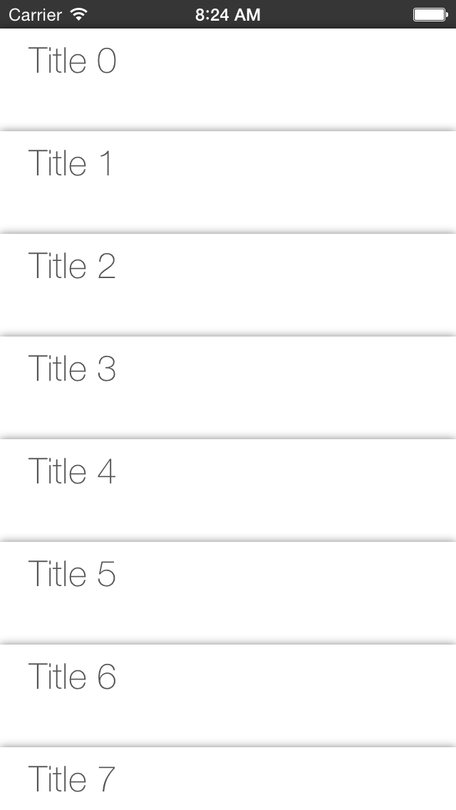

PassbookLayout (iOS 6+)
===============

Mimicking the behaviour of the Passbooks apps in iOS using a custom `UICollectionViewLayout`.

##Installation
Copy the `PassbookLayout` folder that has the `.h` and `.m` into you project. Swap your filthy old `collectionView`'s layout for this beauty, and you're good to go.

You should also probably make sure that your cells behave correctly to the resizes, always sticking to the top. See the attached sample project.

##Customization
Edit the `metrics` struct if you want to mess with the size of the cells and the `effects` struct for the cool effects. Aside from that, try hacking your own stuff on top! Pull requests are welcome :).

##Features

* Passes have a size and an overlay value. Overlay determines how much of one cell is rested on top of the predecessor, the example shows a few "holes" that you can see through.
* When scrolling on top, passes spread out, just like the real passbooks.
* When scrolling downwards, passes get stacked on top, instead of simply scrolling.
* When selecting a pass, all other passes in screen collapse to the bottom of the screen.

##Unsupported features

* Section support, currently, it only supports just section 0.
* Centering cells when there's just a few passes (like passbooks does, could be hacked in).

##Intended use
This collection view is suitable for applications that want to mimick the behaviour of the included Apple Passbook on iOS devices (iOS 6 onwards).

This collection view layout is rather inneficient compared to other layouts, it invalidates for each change of bounds to support it's fancy animations. On the other hand, it only recalculates the currently visible cells, so it can support big numbers of cells, just don't make each cell expensive to redraw/rescale.

And it does not use `UIDynamics`, just math.

##Credits
The original version is currently in use in the "Passport" feature [Skout](http://www.skout.com). This is a clean rewrite of that class and most of the functionality.

## Version History
* **v1.0.0** The passbook layout supports selection, stacking on top, bottom.
* **v1.0.1** Fixed an issue where the unselected cells were positioned wrongly on offsets bigger than zero.
* **v1.0.2** Forgot to remove some NSLogs.