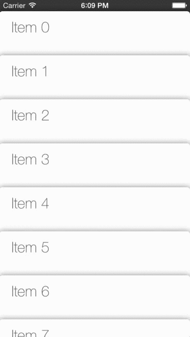

MTCardLayout (iOS 7+)
===============

Mimicking the behaviour of the Passbooks apps in iOS using a custom `UICollectionViewLayout`.

##Installation
Copy the `MTCardLayout` folder that has the `.h` and `.m` into you project. Specify MTCardLayout as layout for your UICollectionView.

`MTCardLayout` depends on `DraggableCollectionView` https://github.com/minhntran/DraggableCollectionView

See the attached sample project.

##Intended use
This collection view is suitable for applications that want to mimick the behaviour of the included Apple Passbook and Reminder on iOS devices (iOS 6 onwards).

This collection view layout is rather inneficient compared to other layouts, it invalidates for each change of bounds to support it's fancy animations. On the other hand, it only recalculates the currently visible cells, so it can support big numbers of cells, just don't make each cell expensive to redraw/rescale.

And it does not use `UIDynamics`, just math.

##Credits
This is a rewrite of the PassbookLayout bt CanTheAlmighty (https://github.com/CanTheAlmighty/PassbookLayout). This is a clean rewrite of that class and most of the functionality.
